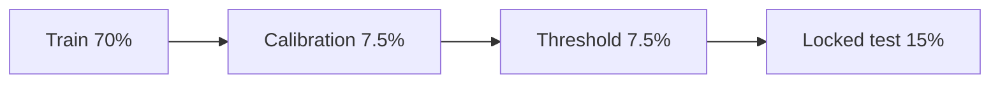
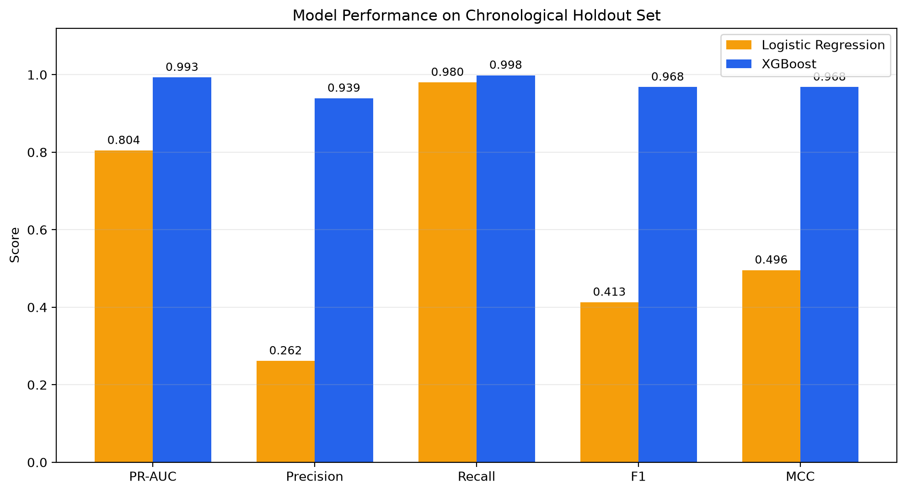
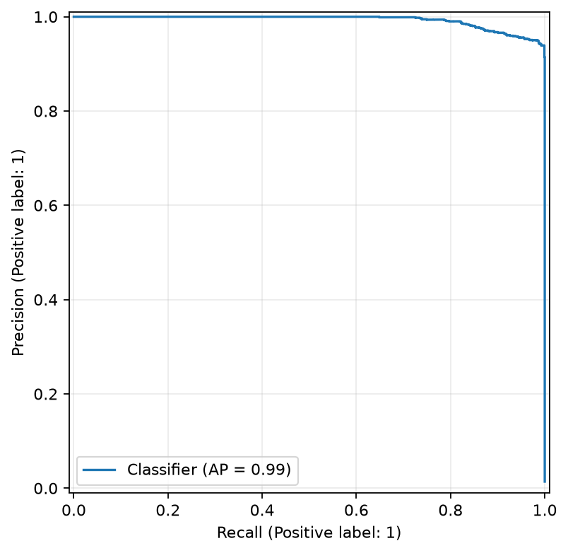
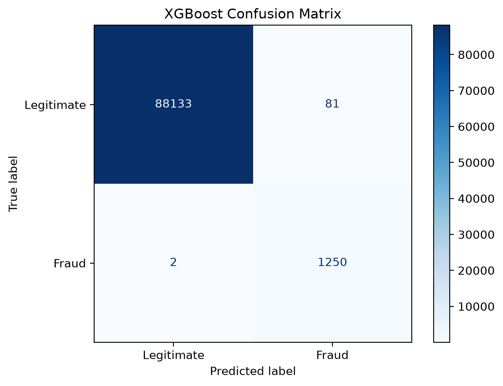
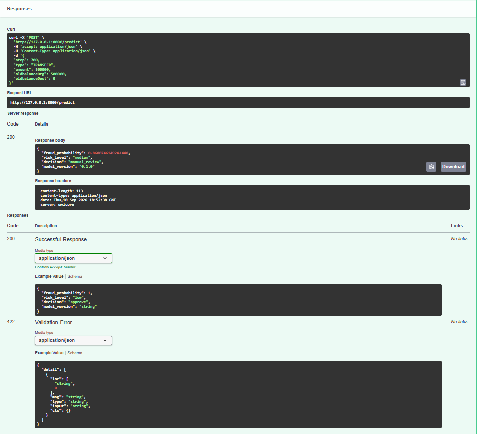
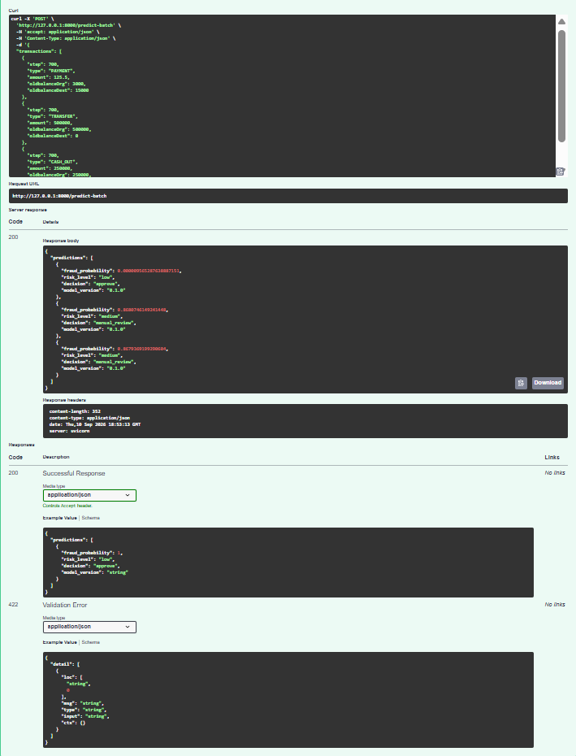
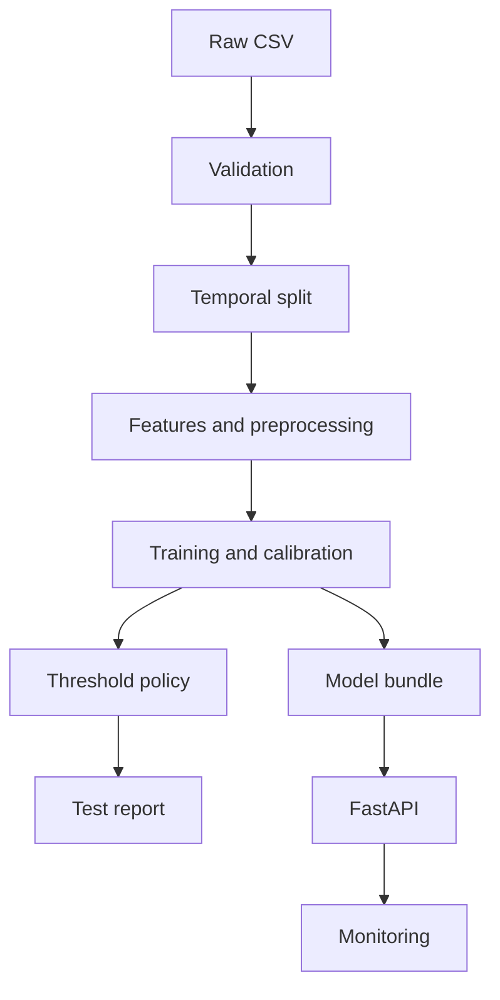

# Production Fraud & Rare-Event Detection System

[](https://github.com/Pabloalvarn/production-fraud-detection/actions/workflows/ci.yml)

Production-oriented fraud detection for highly imbalanced transaction data, combining chronological validation, cost-sensitive decisions, probability calibration, model explainability, API serving and drift monitoring.

> **Portfolio project:** the model uses synthetic PaySim data and must not be used to make decisions about real financial transactions.

## Why this project exists

Fraud detection is not an accuracy problem. Fraud is rare, labels are delayed, investigation capacity is limited, and false positives and false negatives have different consequences. This repository separates three stages that are often incorrectly mixed:

1. Estimating a fraud probability.
2. Validating whether the probability is reliable.
3. Converting the probability into an operational decision using costs and capacity.

## Current status

- [x] Repository architecture
- [x] Data contract and leakage policy
- [x] Chronological splitting
- [x] Leakage-safe feature pipeline
- [x] Logistic Regression and XGBoost training
- [x] Probability calibration
- [x] Validation-based threshold optimisation
- [x] Rare-event and business metrics
- [x] FastAPI inference service
- [x] Docker and CI definitions
- [x] Drift and delayed-label monitoring utilities
- [x] Final PaySim experiment executed
- [x] Model comparison and locked-test evaluation populated
- [x] Model-agnostic permutation importance populated
- [x] Final executive summary populated
- [ ] Public demo deployed

## Dataset

The project uses [PaySim on Kaggle](https://www.kaggle.com/datasets/ealaxi/paysim1), a synthetic dataset generated from aggregated patterns observed in mobile-money logs. It injects fraudulent behaviour to support fraud-detection research. The repository does not redistribute the CSV.

See [`data/README.md`](data/README.md) and [`docs/data_card.md`](docs/data_card.md) before training.

## Problem formulation

The primary model ranks transactions using only information assumed available before authorisation:

- `step`
- `type`
- `amount`
- `oldbalanceOrg`
- `oldbalanceDest`

The following are deliberately excluded:

- `isFraud`: target.
- `isFlaggedFraud`: output of an existing rule.
- `newbalanceOrig`, `newbalanceDest`: post-transaction or ambiguous timing.
- `nameOrig`, `nameDest`: raw high-cardinality identifiers.

This is stricter than using every dataset column, but produces a more credible online use case.

## Leakage-safe evaluation



Complete time steps are assigned chronologically. The model is fitted on training data, calibrated on the earlier validation half, and assigned a decision threshold on the later validation half. The test set is evaluated once after the policy is locked.

## Models

- Dummy and business-rule baselines: documented for analysis.
- Logistic Regression: interpretable supervised baseline.
- XGBoost: non-linear candidate model.
- Optional resampling: random undersampling or SMOTE inside the training pipeline only.

Accuracy is not a selection metric. The primary ranking metric is Average Precision, supported by ROC-AUC, precision, recall, F2, Matthews correlation, Brier score, log loss, fraud-value capture and capacity-constrained metrics.

## Final results

The calibrated XGBoost model was selected over Logistic Regression. Results below come from the locked chronological test partition; the test set was not used for fitting, calibration or threshold selection.

| Metric | Logistic Regression | XGBoost |
|---|---:|---:|
| Average Precision (PR-AUC) | 0.8043 | **0.9929** |
| ROC-AUC | 0.9942 | **0.9999** |
| Precision | 0.2615 | **0.9391** |
| Recall | 0.9800 | **0.9984** |
| F1 | 0.4128 | **0.9679** |
| F2 | 0.6324 | **0.9860** |
| Matthews correlation | 0.4957 | **0.9679** |
| Brier score (lower is better) | 0.006013 | **0.000936** |
| Scenario-based total cost (lower is better) | 859,389.44 | **413,233.61** |

At the validation-selected cost-minimising threshold of `0.86`, XGBoost detected 1,250 of 1,252 fraudulent test transactions, with 81 false positives and two false negatives. It reviewed 1.49% of transactions and captured 99.976% of simulated fraudulent value.

Under a separate strict 1% review-capacity policy, precision was 99.89% and recall was 71.41%. This capacity result is not the same operating point as the cost-minimising threshold; reporting both makes the trade-off explicit.







## Model explanation

Model-agnostic permutation importance, scored by Average Precision on the locked test partition, ranked the five raw online inputs as follows:

| Feature | Mean importance | Standard deviation |
|---|---:|---:|
| `oldbalanceOrg` | 0.9262 | 0.0021 |
| `amount` | 0.9237 | 0.0023 |
| `type` | 0.1525 | 0.0030 |
| `oldbalanceDest` | 0.0503 | 0.0014 |
| `step` | 0.0000 | 0.0000 |

These values describe predictive dependence in this synthetic dataset; they do not establish causal effects.

## API demonstration

The selected model is packaged with its preprocessing, probability calibration and decision thresholds, then served through FastAPI for individual and batch inference.





## Decision policy

The medium-risk threshold minimises an explicitly assumed validation cost:

```text
total cost = false-positive cost
           + false-negative fixed cost
           + missed fraud amount × recoverable fraction
           + review cost
```

An alternative reports precision and recall when only the highest-risk 1% can be reviewed. All costs are scenario inputs and not real savings.

## Architecture



Detailed design: [`docs/architecture.md`](docs/architecture.md).

## Local setup with Visual Studio Code

Working locally in VS Code and pushing completed commits to GitHub is the recommended workflow.

### 1. Clone and open

```bash
git clone https://github.com/Pabloalvarn/production-fraud-detection.git
cd production-fraud-detection
code .
```

### 2. Create an environment

Windows PowerShell:

```powershell
py -3.12 -m venv .venv
.\.venv\Scripts\Activate.ps1
python -m pip install --upgrade pip
python -m pip install -e ".[dev]"
```

macOS/Linux:

```bash
python3.12 -m venv .venv
source .venv/bin/activate
python -m pip install --upgrade pip
python -m pip install -e ".[dev]"
```

Select `.venv` as the Python interpreter in VS Code.

### 3. Add PaySim

Manual route:

```bash
python -m fraud_detection.data.download --source-path "/path/to/downloaded.csv"
```

Kaggle CLI route:

```bash
python -m pip install kaggle
kaggle datasets download -d ealaxi/paysim1 -p data/external --unzip
python -m fraud_detection.data.download \
  --source-path data/external/PS_20174392719_1491204439457_log.csv
```

The CSV is ignored by Git.

### 4. Validate

```bash
python -m fraud_detection.data.validation --config configs/base.yaml
```

For a quick development check:

```bash
python -m fraud_detection.data.validation --config configs/base.yaml --rows 100000
```

### 5. Train the baseline

```bash
python -m fraud_detection.models.train --config configs/model_logistic.yaml
```

### 6. Train XGBoost

```bash
python -m fraud_detection.models.train --config configs/model_xgboost.yaml
```

Generated artifacts are written to:

- `artifacts/model_bundle.joblib`
- `reports/metrics/test_metrics.json`
- `reports/metrics/test_predictions.csv`
- `reports/figures/`
- `mlflow.db` and MLflow artifact storage

To use the supported SQLite tracking backend:

```powershell
$env:MLFLOW_TRACKING_URI = "sqlite:///mlflow.db"
mlflow ui --backend-store-uri sqlite:///mlflow.db
```

### 7. Run tests

```bash
pytest --cov=fraud_detection --cov-report=term-missing
ruff check .
ruff format --check .
```

### 8. Start the API

```bash
uvicorn fraud_detection.api.main:app --reload
```

Open <http://127.0.0.1:8000/docs>.

Example request:

```json
{
  "step": 125,
  "type": "TRANSFER",
  "amount": 9500.0,
  "oldbalanceOrg": 10000.0,
  "oldbalanceDest": 500.0
}
```

### 9. Run with Docker

Train a model first, then:

```bash
docker compose up --build
```

## Configuration

- `configs/base.yaml`: data, paths, decision assumptions and shared settings.
- `configs/model_logistic.yaml`: Logistic Regression.
- `configs/model_xgboost.yaml`: XGBoost.

Values in model files override `base.yaml` through the `extends` field.

## Reproducibility rules

- Never fit preprocessing before splitting.
- Never resample validation or test data.
- Never select thresholds or calibration on test data.
- Never report accuracy alone.
- Keep raw data and trained artifacts outside Git.
- Record final metrics only after locking the pipeline.
- Report assumptions and failed experiments.

## Documentation

- [Problem definition](docs/problem_definition.md)
- [Data card](docs/data_card.md)
- [Architecture](docs/architecture.md)
- [Model card](docs/model_card.md)
- [Monitoring plan](docs/monitoring_plan.md)
- [Limitations](docs/limitations.md)
- [Executive summary](reports/executive_summary.md)

## Roadmap

1. Add point-in-time historical account and velocity features.
2. Compare calibration methods across temporal windows.
3. Add SHAP explanations and segment-level error analysis.
4. Perform cost-sensitivity analysis across alternative operating scenarios.
5. Add authenticated API access, structured observability and security testing.
6. Deploy a public demonstration endpoint.
7. Publish a two-minute technical walkthrough.

## Responsible use

This repository is an educational portfolio project. It does not constitute a production fraud system, and its synthetic-data results cannot be translated directly into financial outcomes or decisions about people.

## License

Source code is available under the MIT License. The PaySim dataset is not distributed by this repository and remains subject to the terms shown by its provider.
