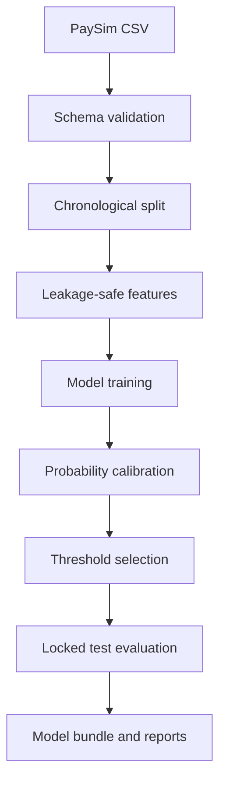
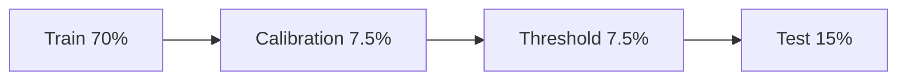
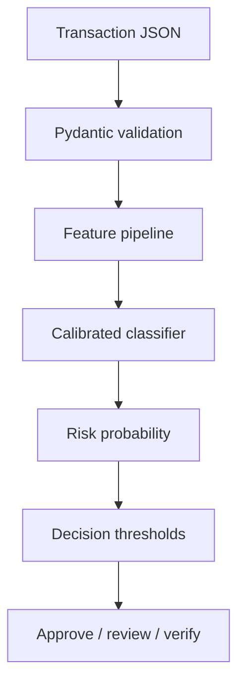
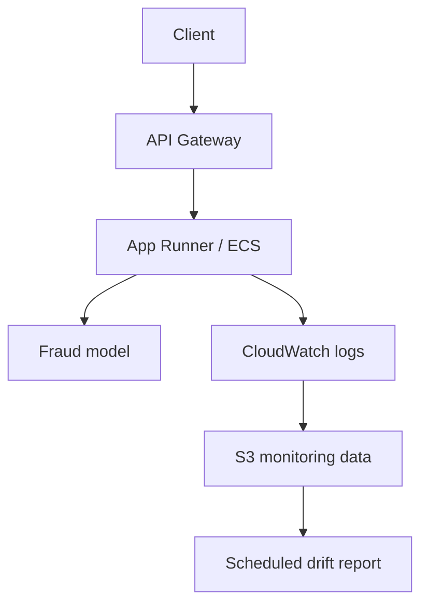

# Architecture

## Training workflow

## Validation partitions

All percentages are chronological approximations based on complete `step` values. No future partition is used to fit an earlier stage.

## Inference workflow

## Component responsibilities

| Component | Responsibility |
|---|---|
| Data validation | Reject incompatible datasets and report warnings |
| Temporal split | Prevent future observations leaking into training |
| Feature builder | Create pre-authorisation features |
| Preprocessor | Impute, scale and encode consistently |
| Estimator | Rank transactions by fraud risk |
| Calibrator | Improve probability interpretation |
| Threshold policy | Translate probabilities into operational actions |
| FastAPI | Validate and serve requests |
| Monitoring | Detect data, score and performance deterioration |

## Artifact contract

Training serialises one `joblib` bundle containing:

- Calibrated pipeline.
- Medium-risk threshold.
- High-risk threshold.
- Model version.
- Required raw features.
- Training and validation boundaries.
- Cost assumptions.
- Final test metrics.

The bundle is generated locally and excluded from Git because serialized model objects are environment-dependent and may be large.

## Future AWS deployment

Cloud deployment is optional. A real architecture would additionally require authentication, encryption, secrets management, network isolation, audit trails, rate limiting and rollback procedures.

